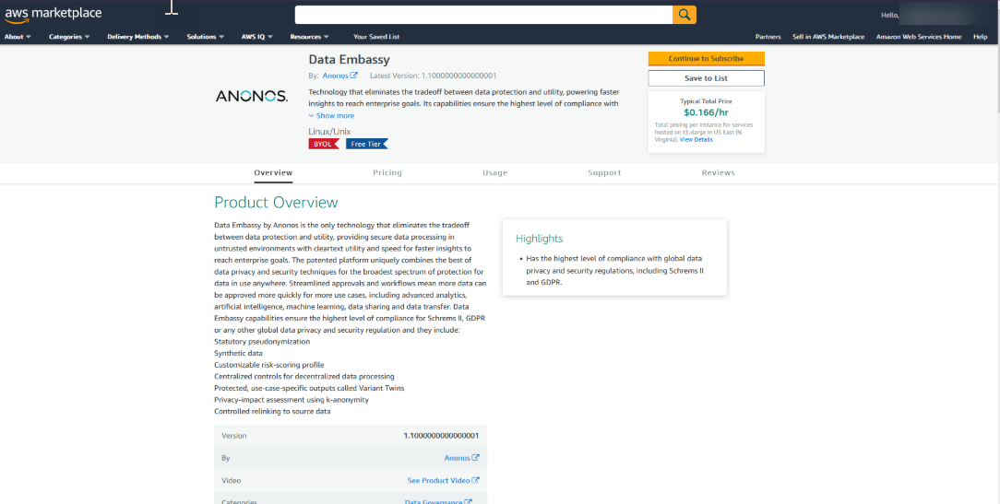
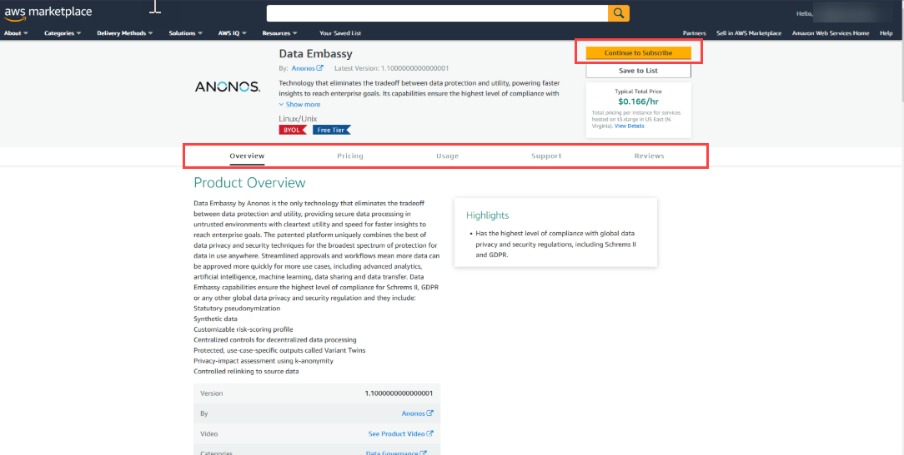
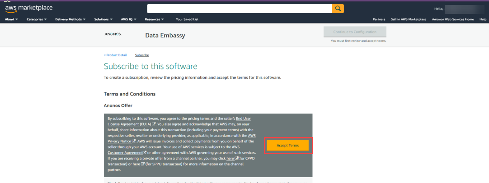
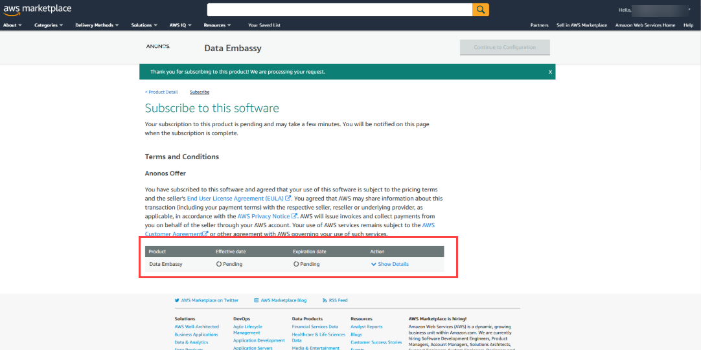
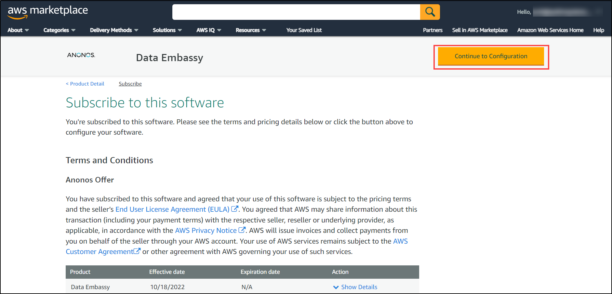
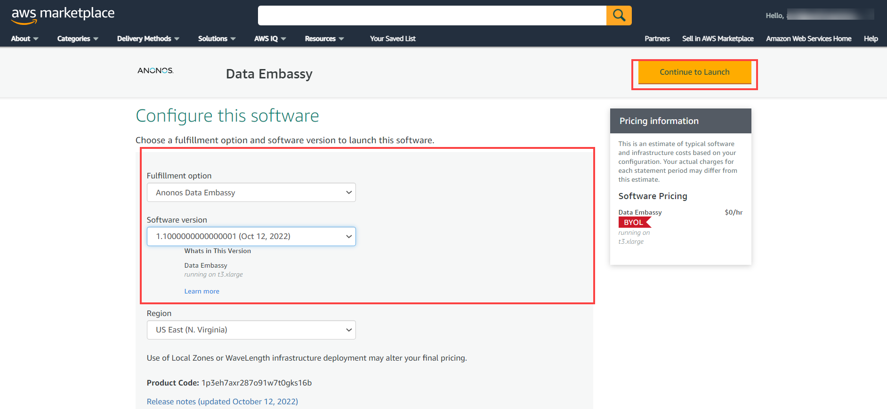
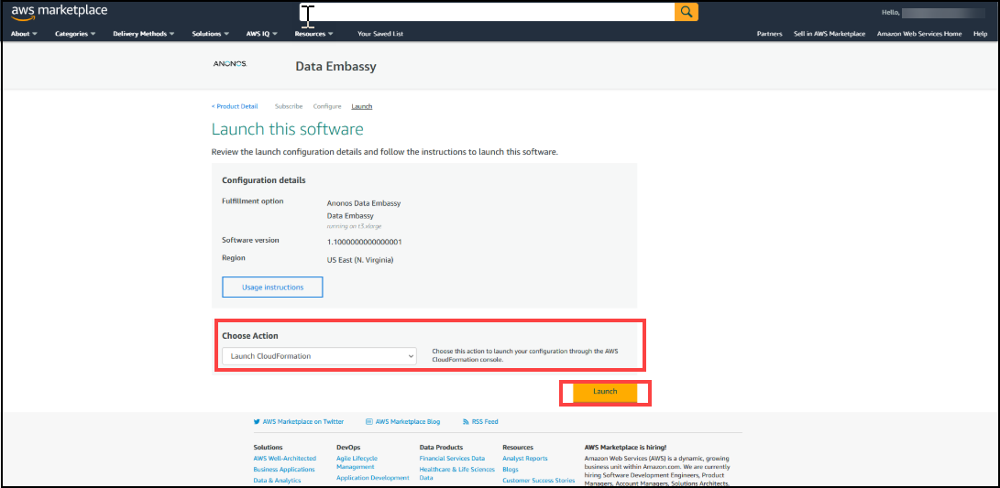
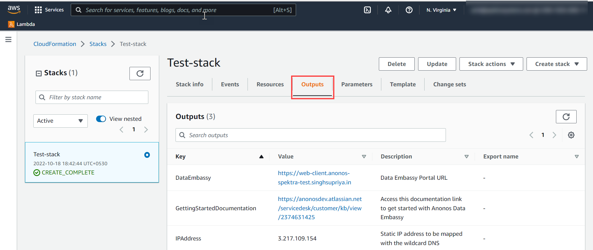

# How to get started with Anonos Offer?

## Overview

Data Embassy® by Anonos® is the only technology that eliminates the tradeoff between data protection and utility, providing secure data processing in untrusted environments with cleartext utility and speed for faster insights to reach enterprise goals. The patented platform uniquely combines the best of data privacy and security techniques for the broadest spectrum of protection for data in use anywhere. Streamlined approvals and workflows mean more data can be approved more quickly for more use cases, including advanced analytics, artificial intelligence, machine learning, data sharing and data transfer. Data Embassy’s capabilities ensure the highest level of compliance for Schrems II, GDPR or any other global data privacy and security regulation and they include: 
•	Statutory pseudonymization 
•	Synthetic data 
•	Customizable risk-scoring profile
•	Centralized controls for decentralized data processing 
•	Protected, use-case-specific outputs called Variant Twins®
•	Privacy-impact assessment using k-anonymity
•	Controlled relinking to source data

## Tasks Included

1. How to access and deploy the offer?

2. What are the next steps after successful deployment of Anonos Offer?

## Pre-requisites

Before getting started with offer, user must fulfill below requirements-

The minimum hardware requirements for a single server are provided below. However, users can select any preferred size from the dropdown as per their requirement.

* **16Gb RAM**
* **30Gb Disk (SSD preferred) + Variant Twin Storage Capacity**
* **2 Processor minimum. Multiple cores recommended, particularly for higher data throughput**

**Note**: Keypairs must be precreated

### 1. How to access and deploy the offer?

1. Navigate to AWS Marketplace Homepage using link- https://aws.amazon.com/marketplace

2. You will be able to see Search Bar in top. 

3. Search for the offer using name "Data Embassy", you will get list of offers listed down.

4. For accurate search result, you can refine results using filters-

    |Setting|Value|
    |---|---|
    |Delivery Methods |**Cloudformation Template**|
    |Publisher|**Anonos Inc.**|
    |Pricing Model|**BYOL**|
    |Operating System|**All Linux/Unix, Ubuntu**|
    
5. Now, click on offer, you will be redirected to offer homepage

 
6. Go through details available in offer overview page, and click on **Continue to Subscribe**

7. In **Subscribe to this software** page, accept terms and conditions by clicking on **Accept Terms**

8. Wait for the completion of subscription process.

   **Note**: **After confirmation of this process, you will be able to view "Effective date" and "Expiration date" against product details**
              
9. Click on "Continue to Configuration" button

10. On **Configure this Software** page, fulfil all details and click on **Continue to launch** button.

    **Note**: **Please ensure to select latest Software version from dropdown**

11. Scroll to the bottom of the page and under **Choose action** select **Launch Cloudformation** and click on **Launch** button.

12. Now, you will be redirected to **Create Stack** page.

13. Configure the Parameters-

    **Instance Setup**

      |Setting|Value|
      |---|---|
      |DataEmbassy EC2 instance type |**Select the preferable size from dropdown**|
      |Key Pair Name|**Please use your own keypair**|
    
    
    **DataEmbassy Configuration**

      |Setting|Value|
      |---|---|
      |Provide the DNS to be mapped to the DataEmbassy Instance |**Enter the DNS name to be mapped with Elastic IP**|
      |License Key Name|**Please enter your License key**|
    
    **Note**: If you do not have the product license key, please contact your Anonos representative for assistance. 
              You may also reach out to Anonos support team using the email Id: solutions@anonos.com
    
    
    **Network Configuration**

      |Setting|Value|
      |---|---|
      |Provide the IP Address range of the VPC|**Enter IP adress range of VPC**|
      |Provide the IP Address range of the Subnet|**Enter IP adress range of Subnet**|
      |Provide the IP Address range for SSH Access|**Enter IP adress range for SSH access**|
    
    
 14. Now Click on **Next**
   
 15. On **Configure Stack options**, click on **Next**

 16. On **Review page**, Click on **Create Stack**

 17. Stack would be created in few minutes. 

 **Note**: If the Stack fails due to non-availability of Availability Zone, then you can launch an instance to an Availability Zone using the old launch wizard, new launch wizard, or using AWS CLI. Or, don't specify an Availability Zone in your request. If you don't specify an Availability Zone, Amazon EC2 chooses an Availability Zone for you that supports your instance type.

**Please refer to this link for more troubleshooting options-**
https://aws.amazon.com/premiumsupport/knowledge-center/ec2-instance-type-not-supported-az-error/

 18. Click on **Outputs** section, to access the Data Embassy Portal and Documentation URL.

 19. Copy the public IP and map it to your DNS.

 **Note**: DNS Propagation might take some time.

### 2. What are the next steps after successful deployment of Anonos Offer?

1. Navigate to the EC2 instance and copy the Public IP, you would require this.

2. SSH to the account using your Public IP. 

3. Now, you will be asked for username.

   **Note**: By default username is **Ubuntu**
   
4. Now, your deployment setup is ready. You can proceed with your tasks. 

