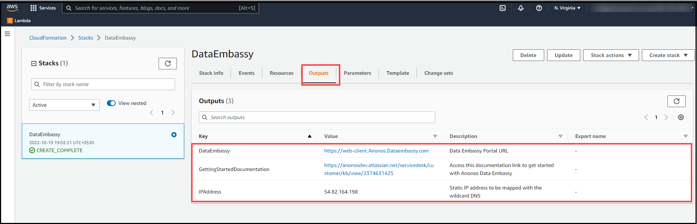

# How to get started with Anonos Offer?

## Overview

Data Embassy® by Anonos® is the only technology that eliminates the tradeoff between data protection and utility, providing secure data processing in untrusted environments with cleartext utility and speed for faster insights to reach enterprise goals. The patented platform uniquely combines the best of data privacy and security techniques for the broadest spectrum of protection for data in use anywhere. Streamlined approvals and workflows mean more data can be approved more quickly for more use cases, including advanced analytics, artificial intelligence, machine learning, data sharing and data transfer. Data Embassy’s capabilities ensure the highest level of compliance for Schrems II, GDPR or any other global data privacy and security regulation and they include: 

•	Statutory pseudonymization 

•	Synthetic data 

•	Customizable risk-scoring profile

•	Centralized controls for decentralized data processing 

•	Protected, use-case-specific outputs called Variant Twins®

•	Privacy-impact assessment using k-anonymity

•	Controlled relinking to source data

## Minimal requirements

Before getting started with offer, you must fulfill below requirements:

•	You must have Key pair precreated in your AWS Account, you might refer to ths link for key pair creation:                         https://docs.aws.amazon.com/AWSEC2/latest/UserGuide/create-key-pairs.html#having-ec2-create-your-key-pair
  

### Deployment

To install Anonos Data Embassy Offer from AWS Marketplace:

1. Navigate to AWS Marketplace Homepage using link- https://aws.amazon.com/marketplace and login using the credentials

2. You will be able to see Search Bar in top. 

3. Search for the offer using name **Data Embassy**, you will get list of offers listed down.

4. For accurate search result, you can refine results using filters-

    |Setting|Value|
    |---|---|
    |Delivery Methods |**Cloudformation Template**|
    |Publisher|**Anonos Inc.**|
    |Pricing Model|**BYOL**|
    |Operating System|**All Linux/Unix, Ubuntu**|
    
5. Now, click on offer and you will be redirected to offer homepage

    

6. On the **Subscribe to this software page**, go through the product license agreement and click on **Continue to Subscribe**.

    

7. In **Subscribe to this software** page, accept terms and conditions by clicking on **Accept Terms**, Wait for the completion of subscription process.

   **Note**: **After confirmation of this process, you will be able to view "Effective date" and "Expiration date" against product details**
              
8. Now click on **Continue to Configuration** button

    

9. On **Configure this Software** page, configure installation settings:

    a. From the Delivery Method drop-down list, choose **Anonos Data Embassy**

    b. From the Software Version drop-down list, select the latest version from dropdown
    
    c. From the Region drop-down list, select an AWS Region in which the EC2 instance running Data Embassy will reside.
    
    
10. Click **Continue to launch** button.

    

11. On the Launch this software page, fill in the following details:

    a. In the Configuration Details section, review the product installation settings
    
    b. From the Choose Action drop-down list, select **Launch CloudFormation**
    
    c. Click on **Launch** and you will be redirected to **Create Stack** page.
    
Data Embassy tools are installed using AWS CloudFormation stacks. In AWS CloudFormation, a stack is a collection of AWS services and resources that you can manage as a single unit. You can create a stack in an AWS account, use resources included in the stack to run an application, or delete a stack if you no longer need it. For more information on AWS CloudFormation stacks, see AWS Documentation.

12. At the Specify template step of the wizard, the stack template settings are preconfigured, click on **Next**

       

13. At the Specify stack details step of the wizard, configure the following stack settings:

    a. In the Stack name field, specify a name for the new stack.
        Specifying Stack Name
        
       

    b. In the **Instance Setup** section, do the following:

       Select the EC2 instance type for Data Embassy Offer.

       i. The recommended EC2 instance type is t3x.large.

       ii.Select a key pair that will be used to authenticate against the backup appliance.
        
    For a key pair to be displayed in the Key pair for Data Embassy Offer, it must be created in the Amazon EC2 console. To learn how to create key pairs, refer to AWS         Documentation: https://docs.aws.amazon.com/AWSEC2/latest/UserGuide/create-key-pairs.html
        
       

14. In the **Data Embassy Configuration** section, do the following:

    a. Provide the DNS to be mapped to the DataEmbassy Instance
        
       Map the Elastic IP present in Stack's **Output** section to the DNS record
            
    b. Provide License Key
        
       Enter the product license key
       
       
            
    **Note**: For details on how to obtain the license, contact Anonos representative for assistance at solutions@anonos.com
    
15. In the **Network Configuration** section, fill in following details:

    a. Provide the IP Address range of the VPC
        
       Make sure the IPv4 address of the local machine from which you plan to Data Embassy lies within the specified IPv4 range.
        
    The IPv4 address ranges must be specified in the CIDR notation (for example, 12.23.34.0/24). To let all IPv4 addresses access Veeam Backup for AWS, you can             specify 0.0.0.0/0 . Note that allowing access from all IPv4 addresses is unsafe and thus not recommended in production environments.
    
    b. Provide IP Adress range of Subnet
        
       Specify the subnet to which the Data Embassy Offer will be connected.
            
    c. Provide IP Adress range for SSH access
        
       Specify IP Address range for SSH Access
         
       
            
            
16. At the **Configure stack options** step of the wizard, specify AWS tags and scroll down and click on **Next**

17. At the Review step of the wizard, do the following:

    a. Review the configured settings
    
    b. Click on Create stack
    
18. Stack would be created in few minutes. 

 **Note**: If the Stack fails due to non-availability of Availability Zone, then you can launch an instance to an Availability Zone using the old launch wizard, new launch wizard, or using AWS CLI. Or, don't specify an Availability Zone in your request. If you don't specify an Availability Zone, Amazon EC2 chooses an Availability Zone for you that supports your instance type.

**Please refer to this link for more troubleshooting options-**
https://aws.amazon.com/premiumsupport/knowledge-center/ec2-instance-type-not-supported-az-error/

    
19. Once the Stack creation is complete, click on **Outputs** section, and review the URLs

     a.DataEmbassy
        
       This URL would take you to DataEmbassy Portal URL.
          
                
     b.GettingStartedDocumentation
        
       Using this URL, you will be redirected to Anonos DataEmbassy Documentation page
             
     c.IPAddress
        
       This is Elastic IP Address. This must be mapped with Wildcard DNS entry.
            
       

 **Note**: DNS Propagation might take up to 10 minutes for DataEmbassy Webpage to show up. Refresh page occasionally to check whether the DataEmbassy login page is appearing
 
 
20. Page like following would appear, now click on **Advanced** to open the advanced options, then proceed on to DataEmbassy login page by clicking on link that follows.

     
     
     

21. Login page would appear, enter the credentials.

     Username is **Admin** and password is **password**
     
     
     
22. You will be asked to update password on your first login. Change the password and proceed on to **Submit** button.

    

23. **End user license agreement** page would appear, accept the license by clicking on **I Agree** 

    

24. Now you will be redirected to DataEmbassy portal
 
    
    
 
 

